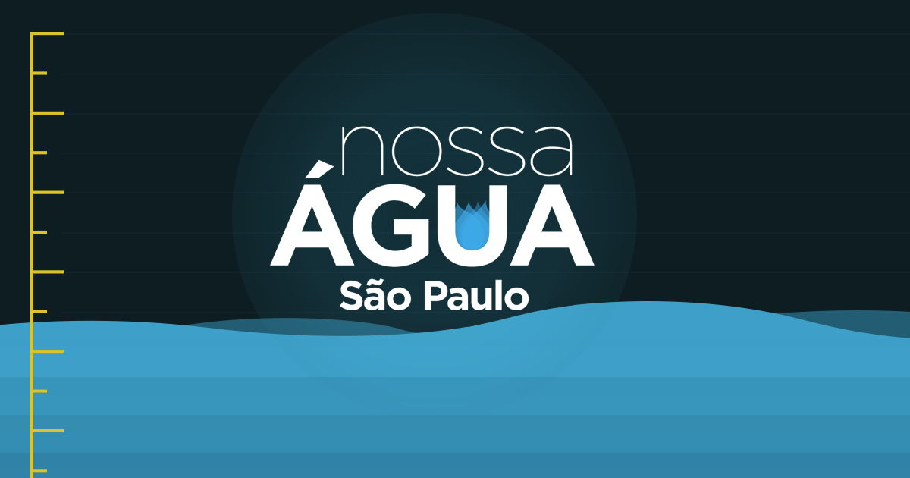

# Nossa Água - São Paulo

Check the level of dams/water supply systems in the Metropolitan Region of São Paulo managed by [Sabesp](https://mananciais.sabesp.com.br/Situacao).

> All the information is provided by a [Crawler API](https://github.com/rafaell-lycan/sabesp-mananciais-api) which I've built during the water shortage back in 2015.

## Current Tech Stack (v2)

- [React](https://reactjs.org/)
- [TypeScript](https://www.typescriptlang.org/)
- [Vite](https://vitejs.dev/) for bundling

**Note:** The previous version was built with AngularJS inherited and adapted from the original project.

## Honorable Mention

_This project is based on [nossa-agua-sp](https://github.com/mamomu/nossa-agua-sp) by @mamomu, and only used for visualization purposes._
